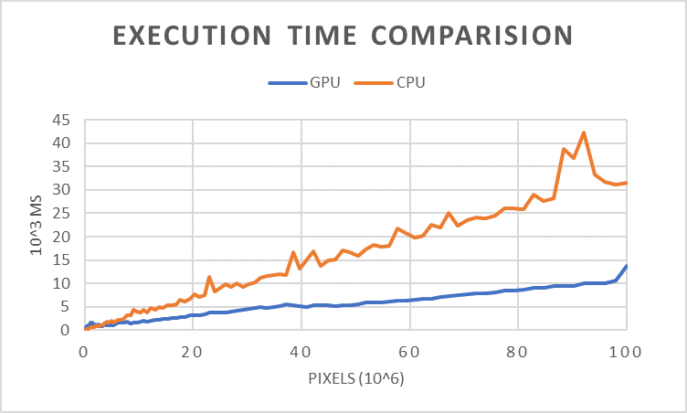

### CUDA-CV

Implementation of Computer Vision algorithms with Nvidia CUDA support.

### Table of contents

1. [Algorithms and Benchmark](#1-algorithms) 
2. [Dependencies](#2-dependencies)
3. [Setup](#3-setup)
4. [Implememtation Notes](#4-implementation-notes)
5. [Work in progress](#5.-wip)

### 1. Algorithms

1. Benchmarked on [this](https://www.flickr.com/photos/142400284@N08/46146227131/in/pool-extremelylargepanoramas/) high-resolution 29192x5140 picture by [Umit Cukurel](https://www.flickr.com/photos/142400284@N08/).  
2. Execution time in seconds.

| Algorithm     | CPU (OpenCV)  | CUDA-CV (GTX-1060)    |
| ------------- |:-------------:| ---------------------:|
| RGB2GRAY      | 0.112 | 0.058 |
| EDGE::SIMPLE |  | 0.018 |
| EDGE::SOBEL | 3.932 | 0.030 |
| EDGE::PREWITT |  | 0.074 |
| FILTER::BOX 3X3 | 0.149 | 0.019 |

### 2. Dependencies

1. OpenCV 3.4 - For converting images to Mat. That's it.
2. CUDA 

### 3. Setup

Entire project is built using CMake (3.9) with MSVC 2017 generator rules on Windows. I will be adding *ix for support after core algorithms have been implemented. 

#### 3.1 Build and Install OpenCV on Windows:

1. Download OpenCV 3.4 source from the [github](https://github.com/opencv/opencv/releases/tag/3.4.4) repo. Lets call this directory as `OPENCV`.
2. Start CMake GUI (I use GUI on Windows because many dependencies have to be manually linked).
3. Point Source to `OPENCV/src`
4. Point Build to `OPENCV/build`
5. Configure. (Here after the config file is generated, you can ignore the modules that you dont need. This project only needs opencv core and highgui.)
6. Set Compiler to MSVC 2017 64. (Mine is 64bit OS.)
7. Generate.
8. Add `OPENCV/build/install/<your_platform>/vc15/lib` to system `Path` variable.
9. Set `OpenCV_DIR` to `OPENCV/build/install`

#### 3.2 Install CUDA 9.2.

1. The .exe downloaded from website is just a compressed file. So, after the setup files have been extracted make a copy of the folder (lets call this `CUDA`). You'll need a few files from this later for CUDA support in MSVC 2017.
2. Install all the components except __Visual Studio Integration__.
3. After the installation is complete copy files under `CUDA/CUDAVisualStudioIntegration\extras\visual_studio_integration\MSBuildExtensions` to `C:\Program Files (x86)\Microsoft Visual Studio\2017\Community\Common7\IDE\VC\VCTargets\BuildCustomizations`
4. Now you have successfully installed and integrated CUDA support in Visual Studio.
5. You might want to edit host_config.h and change the upper limit for MSC_VER greatr than 1911 like this: `#if _MSC_VER < 1600 || _MSC_VER > 1955`

### 4. Implementation Notes

1. Thread blocks are laid into Grids. 
2. All thread blocks are then scheduled and passed over to SMs.
3. SM execute warps of 32 threads. Each thread executes  each executing on 1 core.
4. 1060 has 128 CUDA Cores, thus each clock cycle can execute 4 warps in each SM.
5. Do not include any `.cu` files in the cpp header files `.h`. NVCC mistakes `.cu` as cpp files on account of it being called int he header files and uses native c compiler for compilation instead of nvcc itself compiling it.

### 5. WIP

1. Feature Matching.